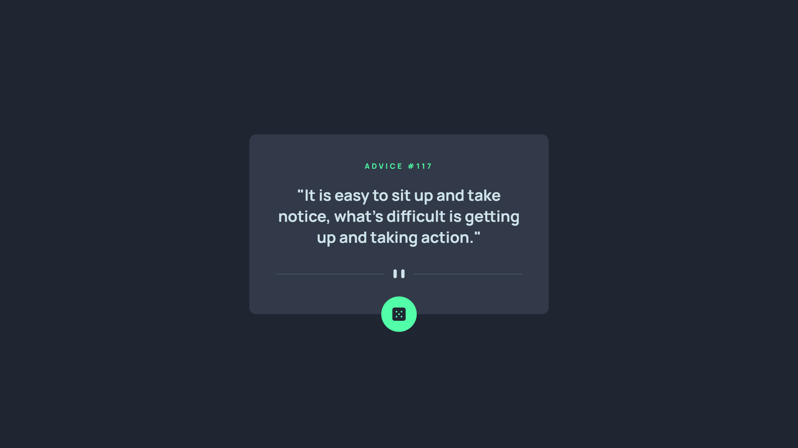

# Frontend Mentor: solución de aplicación generadora de consejos

Esta es una solución al [desafío de la aplicación generadora de consejos en Frontend Mentor](https://www.frontendmentor.io/challenges/advice-generator-app-QdUG-13db). Los desafíos de Frontend Mentor lo ayudan a mejorar sus habilidades de codificación mediante la creación de proyectos realistas.

## Tabla de contenido

- [Resumen](#resumen)
  - [El desafío](#el-desafío)
  - [Captura de pantalla](#captura-de-pantalla)
  - [Enlaces](#enlaces)
- [Mi proceso](#mi-proceso)
  - [Construido con](#construido-con)
  - [Lo que aprendí](#lo-que-aprendí)
  - [Desarrollo continuo](#desarrollo-continuo)
- [Autor](#autor)
- [Agradecimientos](#agradecimientos)

**Nota: elimine esta nota y actualice la tabla de contenido según las secciones que conserve.**

## Resumen



### El desafío

Los usuarios deberían poder:

- Ver el diseño óptimo para la aplicación según el tamaño de pantalla de su dispositivo
- Ver estados de desplazamiento para todos los elementos interactivos en la página
- Genera un nuevo consejo haciendo clic en el ícono del dado

### Captura de pantalla


### Enlaces

- URL de la solución: [https://github.com/Torres2000/advice-generator-app-main](https://github.com/Torres2000/advice-generator-app-main)
- URL del sitio en vivo: [https://generador-de-concejos.netlify.app/](https://generador-de-concejos.netlify.app/)

## Mi proceso

### Construido con

- Marcado semántico HTML5
- Propiedades personalizadas de CSS
- Caja flexible
- Cuadrícula CSS
- Flujo de trabajo móvil primero
- [React](https://reactjs.org/) - Biblioteca JS

### Lo que aprendí

Aprendi a como mostrar los datos de una api utilizando ReactJS

Ejemplo del codigo que utilice

```js
const fetchData = async () => {
  const response = await axios.get("https://api.adviceslip.com/advice");
  const data = response.data.slip;
  let title = document.getElementById("title");
  title.innerHTML = "ADVICE #" + data.id;
  let mensaje = document.getElementById("mensaje");
  mensaje.innerHTML = data.advice;
};
```

### Desarrollo continuo

Necesito aprender mas sobre el uso del de los hooks en react

## Autor

- Sitio web - [Pedro Torres](https://portfolio-web-dev-jose.netlify.app/)
- Mentor de frontend - [@Torres2000](https://www.frontendmentor.io/profile/Torres2000)

## Agradecimientos

Solo un saludo a todos los demás creadores de Frontend Mentor. Es una experiencia de aprendizaje maravillosa ver otras soluciones y ver cómo otros codificadores crean lo mismo.
